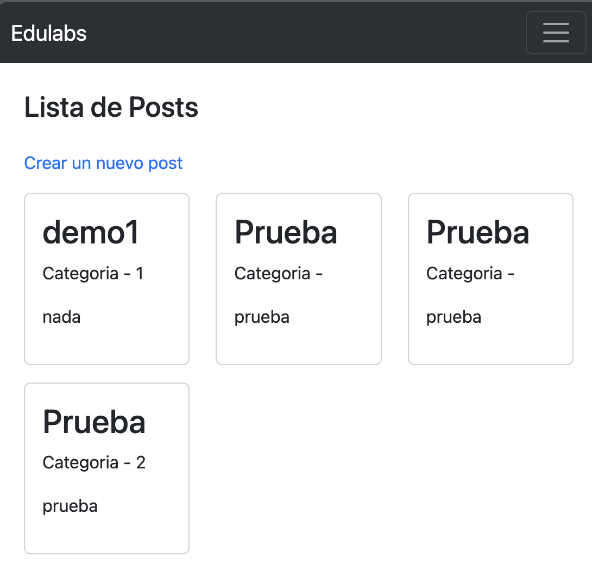
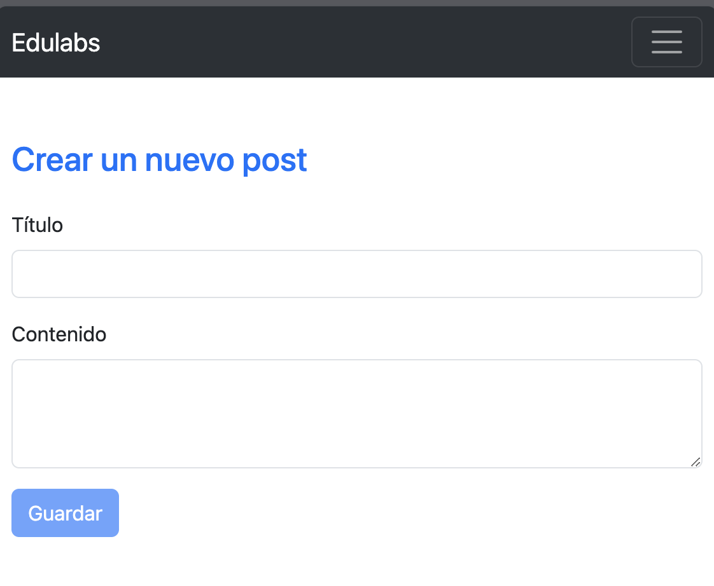
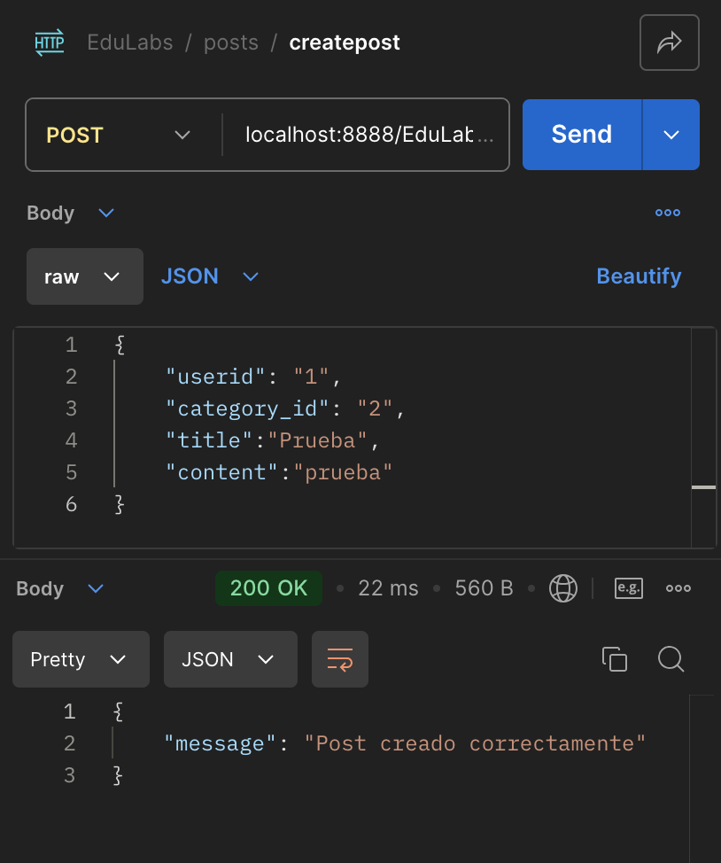
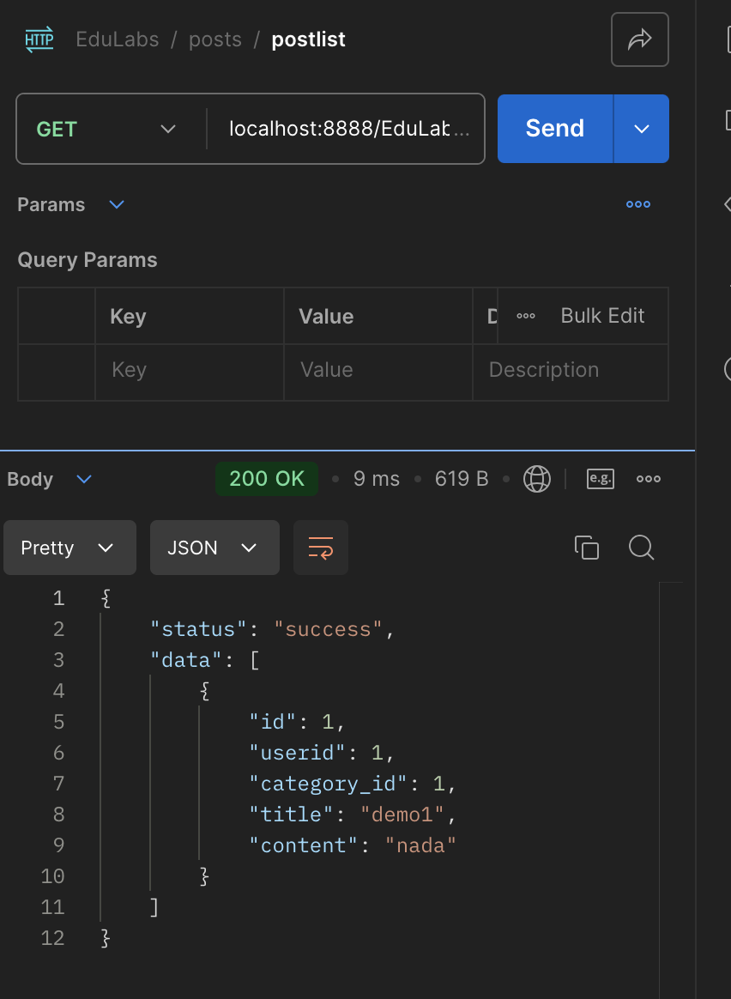
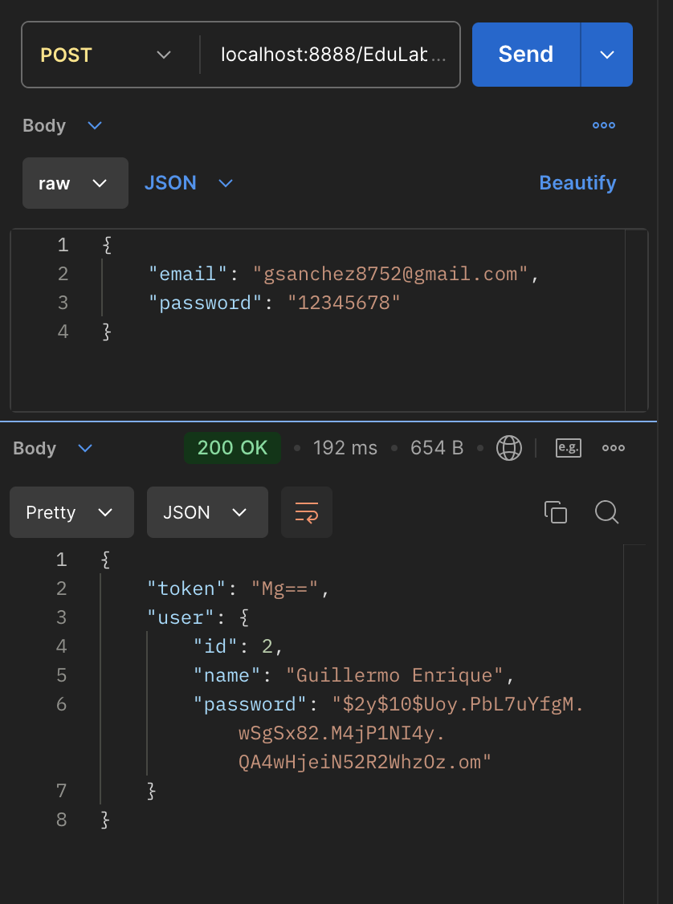

# Requerimientos
```
PHP 8.x o superior
Mysql 5.x o superior
Node 18.x o superior
Angular 14.x o superior
```

## DB config
```
private $host = '127.0.0.1';
private $port = '8889';
private $db_name = 'edulabs';
private $username = 'root';
private $password = 'root';

```

## Feature
```
He realizado este proyecto con php puro sin framework, utilizando clases un programacion orientada a objetos con metodologias SOLID.
1. El sistema de autenticacion es con mysql
2. El frontend con Angular 18
3. El backend con PHP 8.2
```


## Capturas
```
1. Angular18
2. Typescript
3. Bootstrap
```












